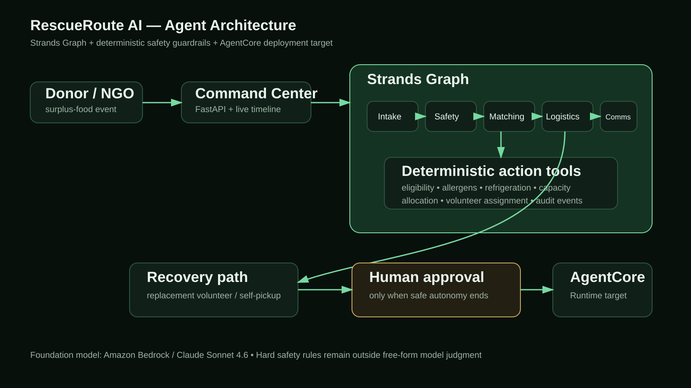

# RescueRoute AI

**Autonomous food-rescue coordination with Strands Agents and Amazon Bedrock AgentCore.**

RescueRoute helps food businesses, food banks, shelters, community kitchens, and volunteers coordinate surplus-food rescue without making a human manually manage every message, eligibility check, allocation, route change, and exception.

> The agent does the routine coordination. Humans are surfaced only when judgment is actually required.

## Why this is an agent, not a chatbot

A donor submits surplus food. RescueRoute then performs real operational work:

1. creates a rescue event;
2. evaluates recipient safety and policy eligibility;
3. allocates food under capacity constraints;
4. assigns logistics;
5. prepares stakeholder notifications;
6. reacts to a volunteer cancellation;
7. attempts autonomous recovery;
8. pauses for a human only when no safe autonomous path remains.

The production path is implemented as a **Strands Graph** with specialized agents for intake, safety, matching, logistics, and communications. Hard safety rules are implemented as deterministic tools, so an LLM cannot “reason around” an allergen or refrigeration constraint.

## Architecture



Detailed architecture: [`docs/ARCHITECTURE.md`](docs/ARCHITECTURE.md)

```text
Donor → Command Center → Strands Graph
                        ├─ Intake Agent
                        ├─ Safety Agent
                        ├─ Matching Agent
                        ├─ Logistics Agent
                        └─ Communications Agent
                                 │
                                 ├─ deterministic tools / guardrails
                                 ├─ operational state
                                 └─ recovery → human approval when required

Deployment target: Amazon Bedrock AgentCore Runtime
Foundation model: Amazon Bedrock / Claude Sonnet 4.6
```

Competition-critical SDK versions are pinned to `strands-agents==1.54.0` and `bedrock-agentcore==1.22.0` for reproducibility.

## Demo UI

Run the local command center:

```bash
python -m venv .venv
```

Windows PowerShell:

```powershell
.venv\Scripts\Activate.ps1
pip install -r requirements.txt
python -m uvicorn rescueroute.web:app --reload --port 8000
```

macOS/Linux:

```bash
source .venv/bin/activate
pip install -r requirements.txt
python -m uvicorn rescueroute.web:app --reload --port 8000
```

Open `http://localhost:8000`.

The UI includes two execution modes:

- **Demo-fast (guardrails):** deterministic workflow for frictionless local evaluation without AWS credentials.
- **Live Strands Graph:** invokes the actual multi-agent Strands Graph and requires AWS/Bedrock credentials.

The deterministic mode is not presented as the competition agent; it exists so judges can inspect the product experience even if they do not configure AWS credentials. The competition implementation is the Strands Graph in `rescueroute/graph_workflow.py`.

## Run the Strands Graph

Configure AWS credentials with Bedrock model access:

```bash
aws configure
export AWS_REGION=us-west-2
export RESCUEROUTE_MODEL=global.anthropic.claude-sonnet-4-6
```

Then start the UI and choose **Live Strands Graph**, or invoke from Python:

```python
from rescueroute.graph_workflow import run_graph_rescue

result = run_graph_rescue(
    "Coordinate: ABC Bakery, 42 sandwiches, 18 bread loaves, pickup 20:30, no nuts, no refrigeration."
)
print(result)
```

## AgentCore Runtime

`main.py` is the AgentCore-compatible entrypoint and uses `BedrockAgentCoreApp`.

Current AWS guidance supports direct Python/Strands projects via the AgentCore CLI. One deployment path is:

```bash
npm install -g @aws/agentcore
agentcore create --project-name RescueRouteProject --name RescueRouteAgent \
  --language Python --framework Strands --model-provider Bedrock --memory none --build CodeZip
```

Copy this project agent code into the generated AgentCore app and deploy with:

```bash
agentcore deploy
agentcore invoke 'Coordinate a rescue from ABC Bakery: 42 sandwiches, 18 bread loaves, pickup before 20:30.'
```

The repository keeps a direct `BedrockAgentCoreApp` entrypoint so the same Strands Graph can be hosted in AgentCore Runtime.

## Safety evaluation

The committed benchmark runs **500 deterministic, seeded safety scenarios** plus **100 failure-recovery scenarios** and validates eight operational invariants:

- rejected recipients never receive an allocation;
- recipient capacity is never exceeded;
- nut-allergen policy is respected;
- refrigeration requirements are respected;
- meal accounting is conserved;
- incomplete allocation always triggers human escalation;
- volunteer cancellation moves to a safe backup when one exists;
- no-safe-logistics cases escalate instead of inventing a plan.

Run:

```bash
python -m rescueroute.evaluate
```

Current committed result:

**500 / 500 safety scenarios passed, 50 / 50 backup recoveries passed, and 50 / 50 forced safe escalations passed.**

See [`evaluation/results.json`](evaluation/results.json).

## Automated tests

```bash
pytest -q
```

Current core test suite covers normal coordination, allergens, refrigeration, capacity, human escalation, autonomous volunteer replacement, and safe escalation when recovery fails.

## Repository map

```text
rescueroute-ai/
├── main.py                         # AgentCore Runtime entrypoint
├── rescueroute/
│   ├── graph_workflow.py           # Strands Graph + specialist agents
│   ├── tools.py                    # Strands @tool actions
│   ├── engine.py                   # deterministic operational guardrails
│   ├── store.py                    # synthetic demo state
│   ├── agentcore_app.py            # BedrockAgentCoreApp
│   ├── web.py                      # FastAPI demo API
│   ├── evaluate.py                 # 600-scenario safety/recovery benchmark
│   └── static/                     # command-center UI
├── tests/                          # engine, API, and SDK integration tests
├── evaluation/                     # methodology + committed benchmark evidence
├── docs/
│   ├── architecture.svg
│   ├── ARCHITECTURE.md
│   ├── JUDGING.md
│   ├── DEMO_SCRIPT.md
│   └── SECURITY.md
├── submission/                     # Devpost and Builder Center drafts
└── .github/workflows/ci.yml
```

## Demo scenarios

### Scenario A — zero-touch coordination

- ABC Bakery
- 42 sandwiches
- 18 bread loaves
- pickup 20:30
- no allergen flag

Expected: all 114 estimated meals are routed and a volunteer is assigned without human intervention.

### Scenario B — autonomous failure recovery

After Scenario A, click **Cancel volunteer → auto-recover**.

Expected: RescueRoute selects the backup volunteer and records the recovery in the audit timeline without escalating to a human.

### Scenario C — safety-driven allocation

Choose **Allergen guardrail**.

Expected: the nut-restricted shelter is excluded before allocation; RescueRoute routes only to eligible organizations.

### Scenario D — explicit human judgment

After a standard rescue, click **Exhaust logistics → human decision**.

Expected: all safe autonomous logistics options are intentionally exhausted for the demo. RescueRoute refuses to fabricate a route and surfaces the approval panel.

### Reproducible container

A standard container path is included for reviewers who prefer Docker:

```bash
docker build -t rescueroute-ai .
docker run --rm -p 8000:8000 rescueroute-ai
```

The default container launches the offline-verifiable command center. AWS credentials are only required for **Live Strands Graph** execution.

## Judging evidence

See [`docs/JUDGING.md`](docs/JUDGING.md) and [`docs/VERIFICATION.md`](docs/VERIFICATION.md) for a direct map to Technical Implementation, Design, Potential Impact, Creativity & Originality, and Presentation.

## Hackathon disclosure

This project is being created during the Agents for Humans submission period. Standard development tools, open-source libraries, and AI coding assistance are used. No pre-existing RescueRoute application code is incorporated. See [`DISCLOSURE.md`](DISCLOSURE.md).

## License

MIT — see [`LICENSE`](LICENSE).
