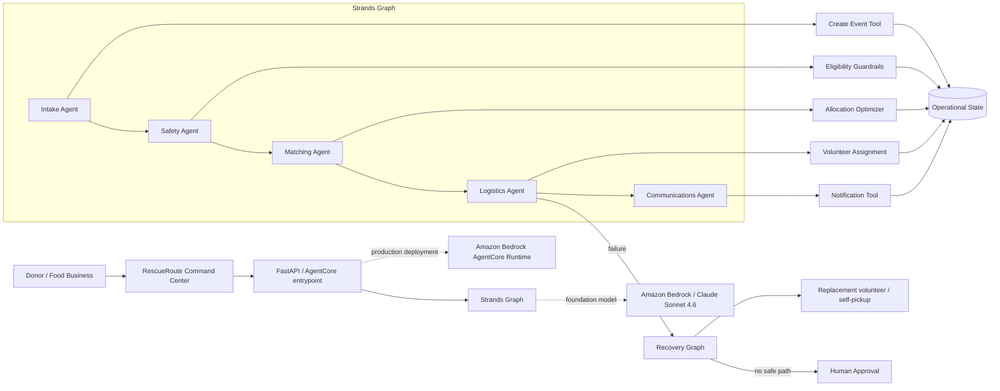

# RescueRoute AI Architecture

RescueRoute intentionally separates **LLM reasoning** from **hard operational guardrails**. Strands agents decide what action to take; deterministic Python tools enforce recipient eligibility, food-safety constraints, capacity limits, and escalation rules.

## Why a graph

The primary workflow is a deterministic sequence of specialized responsibilities:

`intake -> safety -> matching -> logistics -> communications`

This makes execution inspectable and prevents a generic autonomous agent from skipping safety-critical stages. A separate recovery graph demonstrates that the system can respond to operational failure instead of merely reporting it.

## Safety boundary

The model cannot directly decide that a recipient is safe. The eligibility tool rejects recipients when:

- an allergen violates recipient policy;
- refrigeration is required but unavailable;
- the recipient closes before the pickup deadline.

Allocation only sees eligible recipients and enforces explicit capacity. If safe capacity is insufficient, the workflow sets `human_approval_required=true` rather than weakening a safety rule.

## Current persistence

The hackathon demo uses an in-memory operational store so reviewers can run the project with minimal setup. The storage boundary is isolated in `rescueroute/store.py`; DynamoDB is the intended production replacement.

## AgentCore

`main.py` and `rescueroute/agentcore_app.py` provide an AgentCore Runtime-compatible entrypoint using `BedrockAgentCoreApp`. The deployed path executes the same Strands Graph used by the local project.
